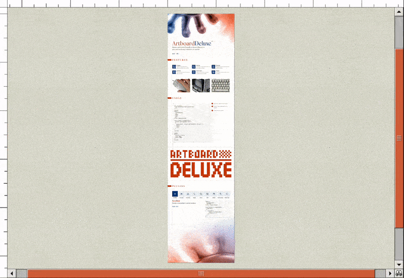

# Artboard Deluxe - Mouse and touch friendly artboard library

**[Demo](https://artboard-deluxe.dulnan.net)** -
**[Docs](https://artboard-deluxe.dulnan.net/docs)** -
**[NPM](https://npmjs.com/package/artboard-deluxe)**

- Uses mouse, touch or wheel events to pan, drag, scroll or zoom
- Smooth/momentum scrolling, animations, scroll velocity
- Works with a DOM element or HTML canvas (2D, WebGL)
- Plugins for rendering scrollbars, overview or additional interactions
- Plugin for adding keyboard shortcuts (Arrow, Page Up/Down, Ctrl+0, etc.)



## Usage

```bash
npm install --save artboard-deluxe
```

### Minimal Example

```html
<div id="root">
  <div id="artboard">Hello World!</div>
</div>

<style>
  #root {
    position: relative;
    width: 500px;
    height: 500px;
  }

  #artboard {
    background: white;
  }
</style>

<script>
  import { createArtboard, mouse, wheel, raf, dom } from 'artboard-deluxe'

  const artboard = createArtboard(document.getElementById('root'), [
    dom({
      element: document.getElementById('artboard'),
    }),
    mouse(),
    wheel(),
    raf(),
  ])
</script>
```
