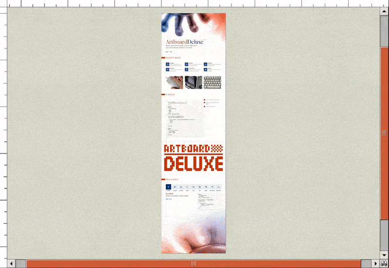

# Getting Started



Install the package with your favorite package manager:

```bash
npm install --save artboard-deluxe
```

## Minimal example

This is a minimal example to get started. It uses four plugins:

- `dom()` to use a DOM element as the artboard
- `mouse()` to allow dragging/scrolling using the mouse
- `wheel()` to allow scrolling and zooming using a mouse wheel
- `raf()` to call the `artboard.loop()` method repeatedly in a
  `requestAnimationFrame` callback

```html
<div id="root">
  <div id="artboard">Hello World!</div>
</div>

<script>
  import { createArtboard, dom, mouse, wheel, raf } from 'artboard-deluxe'

  const artboard = createArtboard(document.getElementById('root'), [
    dom({ element: document.getElementById('artboard') }),
    mouse(),
    wheel(),
    raf(),
  ])
</script>

<style>
  #root {
    position: relative;
    width: 500px;
    height: 500px;
    background: grey;
  }

  #artboard {
    background: white;
  }
</style>
```

The `dom()` plugin will automatically set the correct `position`,
`transform-origin`, `top` and `left` styles on `#artboard`.
